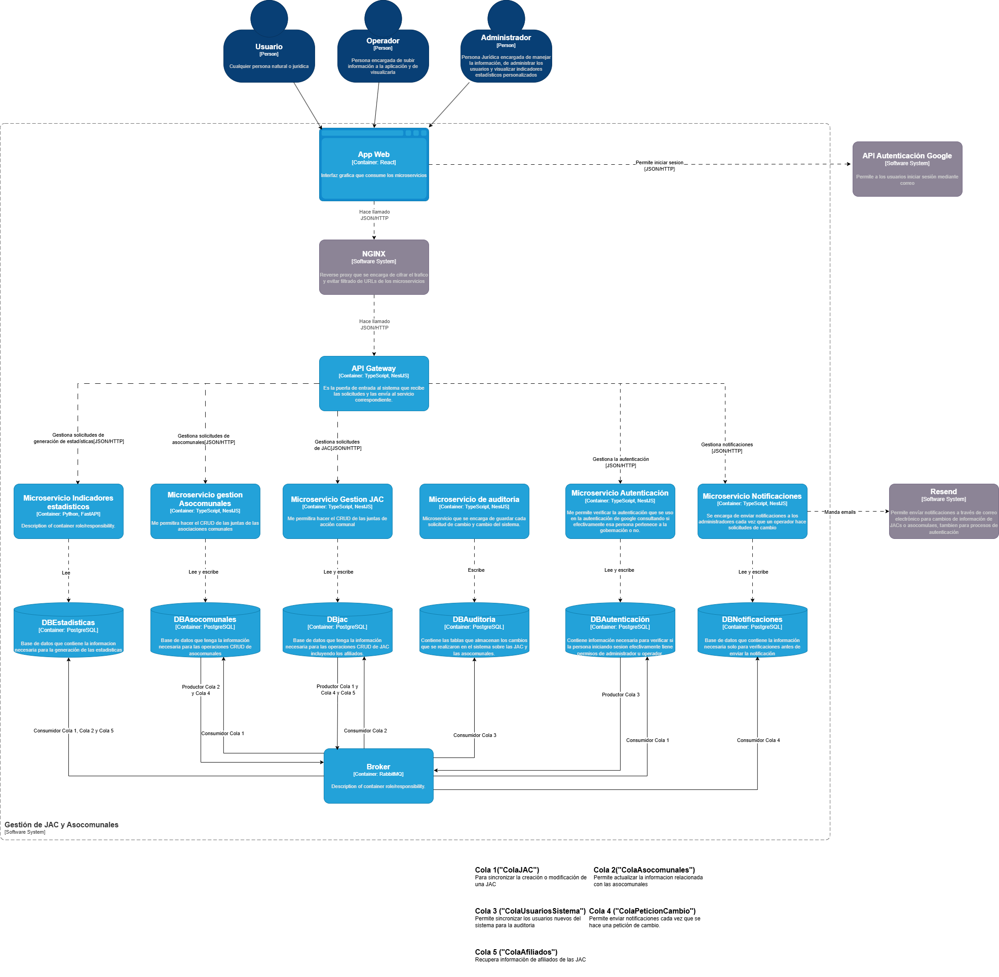

  

[circleci-image]: https://img.shields.io/circleci/build/github/nestjs/nest/master?token=abc123def456
[circleci-url]: https://circleci.com/gh/nestjs/nest

  
A progressive <a href="http://nodejs.org" target="_blank">Node.js</a> framework for building efficient and scalable server-side applications.

    

  
    
  

  <!--
  -->

# JAC Backend

Microservicio desarrollado en NestJS para la gestión de Juntas de Acción Comunal (JAC) dentro del departamento del Cauca. Este servicio forma parte de una plataforma gubernamental orientada a modernizar y centralizar la información de organizaciones comunitarias, facilitando su administración y trazabilidad en un entorno real de operación con entidades públicas.

---

## 📌 Descripción General

Este microservicio es responsable de:

- Gestión completa (CRUD) de:
  - Juntas de Acción Comunal (JAC)
  - Afiliados pertenecientes a cada JAC
- Procesos de migración de datos desde archivos Excel hacia una base de datos relacional
- Sincronización de información con otros microservicios mediante mensajería asíncrona

Hace parte de una arquitectura distribuida compuesta por 6 microservicios, donde cada uno tiene una responsabilidad específica dentro del ecosistema.

---

## 🏗️ Arquitectura

El sistema sigue una arquitectura de microservicios asíncrona, utilizando:

- RabbitMQ como broker de mensajería para comunicación desacoplada
- JWT para autenticación y autorización (gestionado por un microservicio independiente)
- PostgreSQL como sistema de base de datos relacional
- NestJS como framework principal

### Flujo general:

1. El cliente realiza una petición autenticada (JWT en cookie HTTP-only)
2. El API Gateway valida el acceso
3. El microservicio JAC procesa la lógica de negocio
4. Se emiten eventos a través de RabbitMQ para mantener consistencia entre servicios

---

## Arquitectura del Sistema

---

## ⚙️ Puesta en marcha

### 1. Instalación de dependencias

npm install

---

### 2. Configuración de entorno

Copia el archivo .env.example a .env y ajusta los valores según tu entorno.

| Variable | Uso |
|---|---|
| NODE_ENV | Entorno de ejecución |
| PORT | Puerto del servicio |
| DB_HOST | Host de PostgreSQL |
| DB_PORT | Puerto de PostgreSQL |
| DB_NAME | Nombre de la base de datos |
| DB_USER | Usuario |
| DB_PASSWORD | Contraseña |
| RABBITMQ_URI | URI del broker |
| RABBITMQ_JAC_QUEUE | Cola de eventos JAC |
| RABBITMQ_ASCOMUNAL_QUEUE | Cola de eventos Asocomunal |
| JWT_SECRET | Secreto de firma JWT |
| CORS_ORIGIN | Origen permitido |
| COOKIE_NAME | Nombre de cookie de autenticación |

Nota:
El valor de COOKIE_NAME debe coincidir con el microservicio de autenticación.

---

### 3. Inicialización de la base de datos

npm run start:dev

Esto permitirá a TypeORM generar las tablas automáticamente.

---

### 4. Migración de datos desde Excel

#### Crear entorno virtual

python -m venv migracion_env
.\migracion_env\Scripts\Activate.ps1

#### Instalar dependencias

pip install -r migracion/migracion_requirements.txt

#### Preparar archivo de datos

- Crear carpeta statics/
- Colocar el archivo datos.xlsx

Nota de seguridad:
El archivo real no se incluye en el repositorio para proteger datos sensibles.

---

### 5. Ejecutar scripts de migración

#### - Datos base
migracion/seed-cargo.sql

#### - Migración principal
migracion/migracion.py

#### - Limpieza post-migración
migracion/post-migracion.sql

---

## 🚀 Ejecución

### - desarrollo
npm run start

### - modo watch
npm run start:dev

### - producción
npm run start:prod

---

## 🧪 Pruebas

### - unitarias
npm run test

### - e2e
npm run test:e2e

### - cobertura
npm run test:cov

---

## 🔐 Consideraciones de Seguridad

- La autenticación se maneja mediante JWT en cookies HTTP-only
- No se incluyen datos reales ni credenciales en el repositorio
- La comunicación entre microservicios es desacoplada mediante eventos
- Se recomienda ejecutar este sistema en entornos controlados

---

## 🎯 Contexto del Proyecto

Este sistema está diseñado para operar en un entorno institucional, apoyando la gestión de organizaciones comunitarias en el departamento del Cauca. Su enfoque principal es:

- Centralización de información
- Mejora en la trazabilidad de datos
- Reducción de procesos manuales
- Integración entre entidades